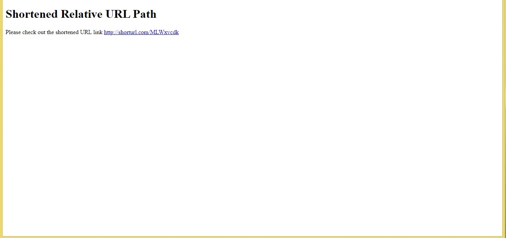

## URL shortner prototype on Kubernetes
This is a nifty use case of deploying a URL shortening service on a K8s cluster, whose workloads are served between two sets of pods.
1. Python Flask application to assign and redirect shortened links to full URLs
2. Stateful Mongo database replicas to store the mappings between shorten links and full URLs

### End-to-end steps to set up everything from scratch
(1) Build a docker image for the frontend Flask application.
~~~
git clone https://github.com/snpsuen/URLShortenStateful.git
cd URLShortenStateful
docker build -t <username>/urlshortenstateful:v1 -f Dockerfile .
docker login -u <username>
docker push <username>/urlshortenstateful:v1
~~~

(2) Deploy a K83 stateful set for the backend Mongo database replicas from this repo.
~~~
kubectl apply -f https://raw.githubusercontent.com/snpsuen/URLShortenStateful/main/manifest/mongo-secret.yaml
kubectl apply -f https://raw.githubusercontent.com/snpsuen/URLShortenStateful/main/manifest/mongostate-configmap.yaml
kubectl apply -f https://raw.githubusercontent.com/snpsuen/URLShortenStateful/main/manifest/mongostate-stateful-service.yaml
~~~

(3) Wait for the mongo dayabase replicas to come up. After that, deploy a K83 service for the frontend Flask application from this repo, which is based on the docker image built in Step 1.
~~~
kubectl apply -f https://raw.githubusercontent.com/snpsuen/URLShortenStateful/main/manifest/urlshortenstateful-deployment-service.yaml
~~~
The frontend service is normally assigned an external IP and hostname, which will form the host part of a shorten URL. Alternatively, it can be accessed via a NodePort on the K8s cluster nodes. In this case, the shorten URL will take the form of, http://node:nodeport/<short_string>

(4) The service is now ready to go. Just land in the frontend service home page via its external IP or NodePort, enter a desirable URL and test it out.

Click at the returned shorten link to verify redirection to the original URL.

